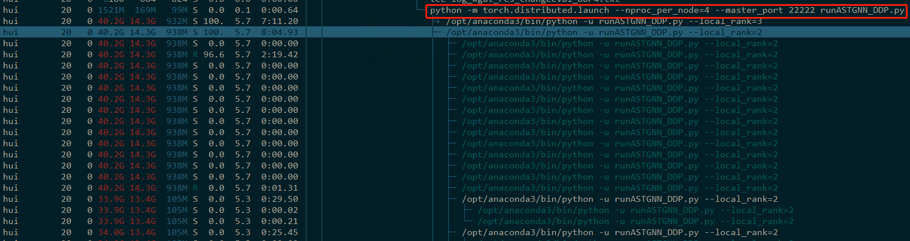

# PyTorch_DDP_Demo
A demo for illustrating how to use `torch.nn.parallel.DistributedDataParallel` with multiple GPUs in one machine. The program is modified from PyTorch example [Image classification (MNIST) using Convnets](https://github.com/pytorch/examples/tree/master/mnist).

- `runMNIST.py`: use single GPU
- `runMNIST_DDP.py`: use multiple GPUs in one machine
- `logs` folder contains the log files

# Environment
- Intel(R) Xeon(R) CPU E5-2678 v3 @ 2.50GHz
- 4 GeForce RTX 2080 Ti Graphics Cards
- 128 GB RAM
- Python 3.7.4
- PyTorch 1.4.0

# How to run
For DDP example `runMNIST_DDP.py`, you must run the program in the terminal directly (instead of some python IDEs) if you wish to use multiple GPUs:
```
python -m torch.distributed.launch --nproc_per_node=NUM_GPUS_YOU_HAVE --master_port ANY_LOCAL_PORT runMNIST_DDP.py
# For example
python -m torch.distributed.launch --nproc_per_node=4 --master_port 22222 runMNIST_DDP.py
```

`NUM_GPUS_YOU_HAVE` is the number of GPUs you will use which must be consistent with line 233 of `runMNIST_DDP.py`. `ANY_LOCAL_PORT` is a random port number which is not occupied (larger than 1023). 

For single GPU example `runMNIST.py` or `runMNIST_DDP.py` using CPU or single GPU, directly run it in terminal or any IDEs:
```
python runMNIST.py
python runMNIST_DDP.py
```

# How to learn
Compare `runMNIST_DDP.py` with `runMNIST.py` and pay attention to the comments starting with `DDP Step`. These are what you need to add to make your program parallelized on multiple GPUs. 
- DDP Step 1: Devices and random seed are set in set_DDP_device().
- DDP Step 2: Move model to devices.
- DDP Step 3: Use DDP_prepare to prepare datasets and loaders.
- DDP Step 4: Manually shuffle to avoid a known bug for DistributedSampler.
- DDP Step 5: Only record the global loss value and other information in the master GPU.
- DDP Step 6: Collect loss value and other information from each GPU to the master GPU.

The log files in `logs` folder show that using single GPU costs 183.18 seconds and using 4 GPUs costs 112.59 seconds. Sometimes using more GPUs will not significantly reduce the time. Instead, more RAM is needed since some data is copied for parallelization. You must choose an appropriate number of GPUs for your program.


# Notes
1. `torch.nn.DataParallel` is not recommended over multiple GPUs. Check the [officical documents](https://pytorch.org/tutorials/intermediate/ddp_tutorial.html#comparison-between-dataparallel-and-distributeddataparallel) for the reasons.
2. To simplify, the program assumes the batch size is divisible by the number of GPUs, e.g., batch size is 64 and 4 GPUs are used.
3. Use `master_print` instead of `print` to avoid printing duplicated information. 
4. For reproducibility, we must manually set a random seed. `set_DDP_device()` function in `DDPUtil.py` has done this by calling `set_seed()`. This way, you will always get the same results when running the program.
5. Functions in `DDPUtil.py` are designed to be flexible so that it supports using CPU, using single GPU and using multiple GPUs with DDP. You can change lines 231-233 of `runMNIST_DDP.py`. Writing you program like `runMNIST_DDP.py` so that you can debug with single GPU or CPU and run program with multiple GPUs after your finish designing your program.
6. DataLoader has a parameter `num_workers` which means how many processes are processing the data in CPU for loading batch data. Increasing `num_workers` will make your program faster too. Check line 206 of `runMNIST_DDP.py`.
7. To access custom functions except `forward` or class variables, use `model.module.function()` or `model.module.variable` since DDP has wrapped your original model.
8. When running program with DDP, make sure to monitor the GPU usage with `watch -n 1 nvidia-smi` and check whether all the GPUs are working properly. For example, the following picture shows the usage of GPUs when running `runMNIST_DDP.py` with four GPUs:

9. If you manually stop the program using multiple GPUs, use `htop -u YOUR_USER_NAME` to check whether all the processes are really killed. For example, the following picture shows that my program `runASTGNN_DDP.py` has 4 processes with different local rank numbers. You can use `pkill -f "runASTGNN_DDP.py"` to kill all the processes partially matching the name `runASTGNN_DDP.py`.
